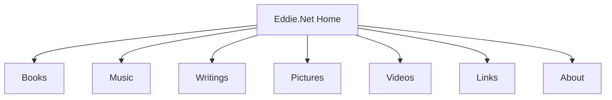

# Eddie.Net Website 

## [eddie-0di.pages.dev](https://eddie-0di.pages.dev/)


This is the website of Eddie.
The website showcases various aspects of Eddie's life and work, including 
books, music, writings, pictures, videos, and links.

## Table of Contents

- [Installation](#installation)
- [Usage](#usage)
- [Project Structure](#project-structure)
- [Design Decisions](#design-decisions)
- [Contributing](#contributing)
- [License](#license)

## Installation

To get a local copy up and running, follow these simple steps:

1. Clone the repository:  
   ```sh
   git clone https:/ /github.com/edisedis777/eddie-net-website.git
   ```
2. Open the project in your preferred code editor.

## Usage

Open the `index.html` file in your web browser to view the website.

## Project Structure

```plaintext
eddie-net-website/
├── images/
│  ├── mailaddress.jpg
|  ├── favicon.ico
|  └── eddie-portrait.gif
    ├── index.html
├── eddie-net-stylesheet.css
├── about.html
├── about-cv.html
├── books.html
├── index.html
├── links.html
├── music.html
├── pictures.html
├── videos.html
├── writings.html
└── README.md
```

## Design Decisions

1. **HTML Structure**: The website uses a simple HTML structure with a header and links to different sections of Eddie's work.
2. **CSS Styling**: The CSS file eddie-net-stylesheet.css is used to style the website, ensuring a consistent look and feel.
3. **Responsive Design**: The website includes a viewport meta tag to ensure it is responsive and looks good on different devices.
4. **Image Map**: An image map is used for the portrait image to create a clickable area that links to the "About" page.

## Flowchart of the Website Structure



### Flowchart Items Description

| Item | Description |
| --- | --- |
| Home | The main landing page of the website, featuring links to various sections of Eddie's work and interests. |
| Books | A section dedicated to books that Eddie recommends. |
| Music | A section showcasing Eddie's playlists. |
| Writings | A section containing Eddie's writings. |
| Pictures | A gallery of pictures taken by Eddie, including personal photos and photography. |
| Videos | A collection of videos that Eddie recommends. |
| Links | A curated list of links to websites, resources, and other content that Eddie finds interesting or useful. |
| About | An "About" page providing more information about Eddie, his background, interests, and contact information.|


## Contributing

Contributions are welcome! Please fork the repository and create a pull request with your changes.

## License

Distributed under the GNU Affero General Public License v3.0 License. See `LICENSE` for more information.
```
